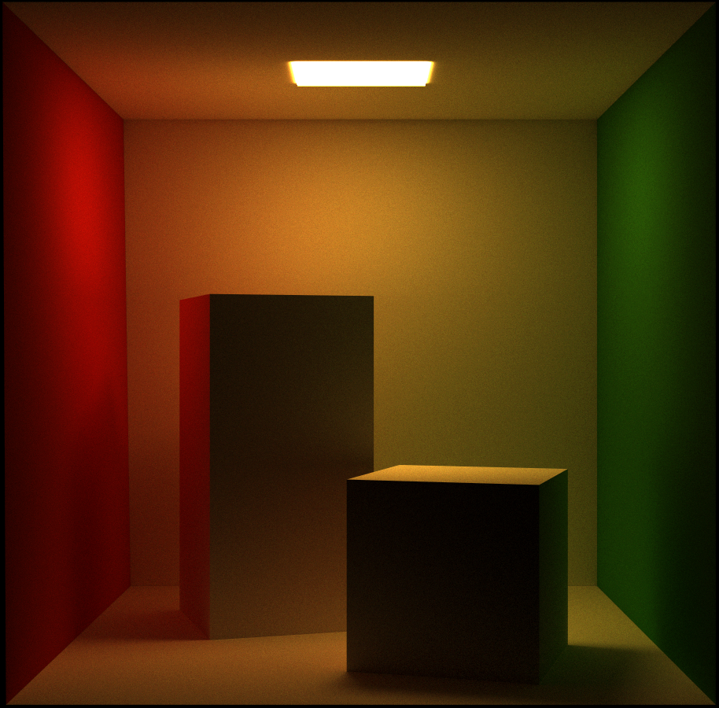
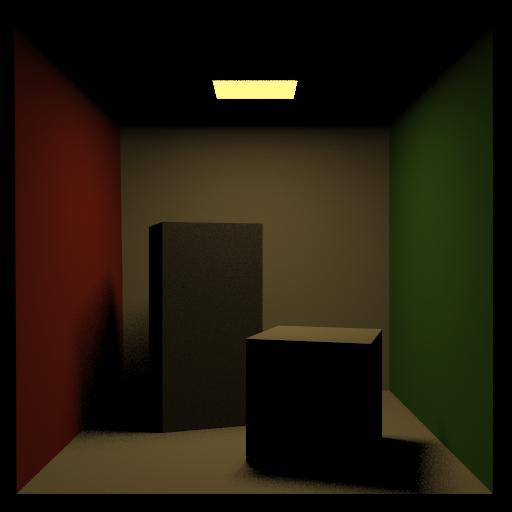
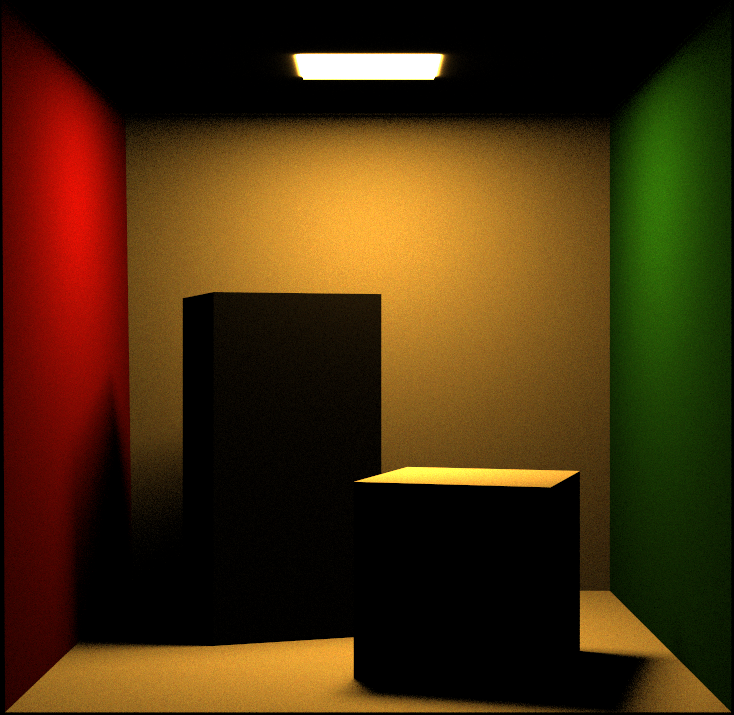
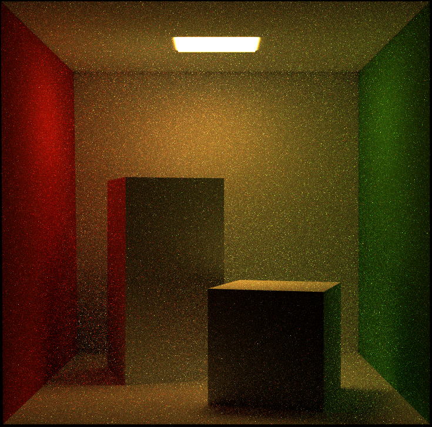
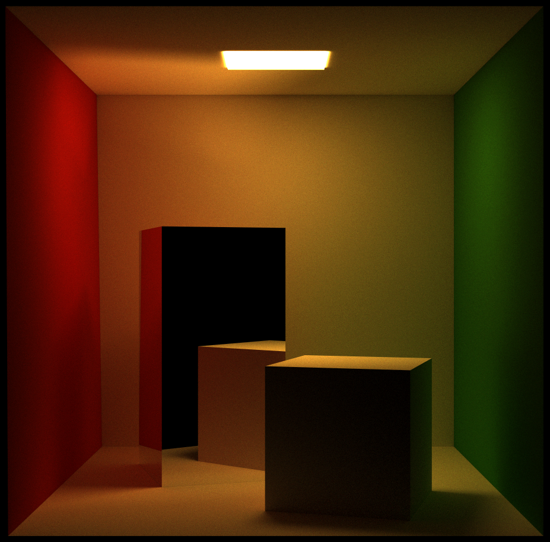
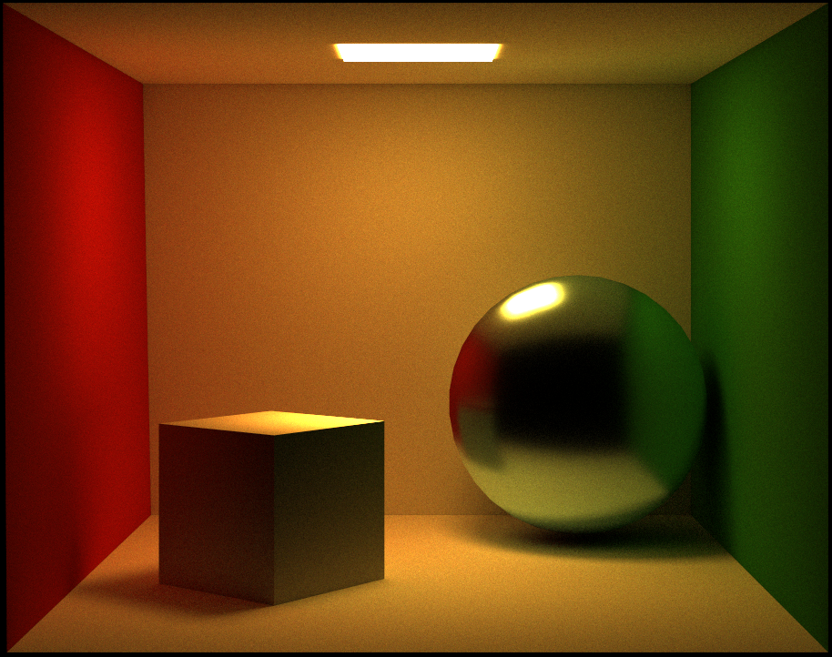
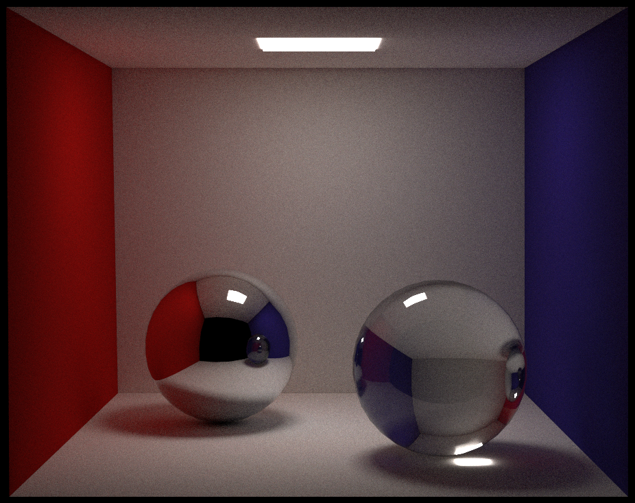
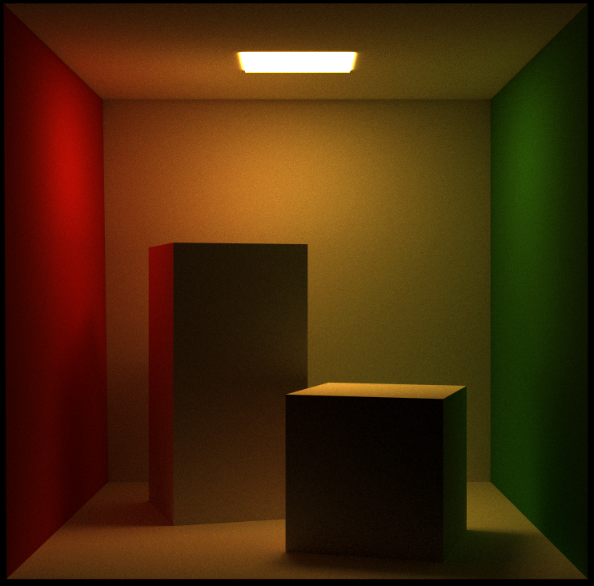
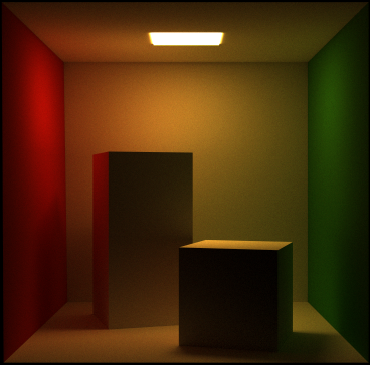

## Path (final submission)

Please fill this out and submit your work to Gradescope by the deadline.

### Output Comparison
Run the program with the specified `.ini` config file to compare your output against the reference images. The program should automatically save to the correct path for the images to appear in the table below.

If you are not using the Qt framework, you may also produce your outputs otherwise so long as you place them in the correct directories as specified in the table. In this case, please also describe how your code can be run to reproduce your outputs

> Qt Creator users: If your program can't find certain files or you aren't seeing your output images appear, make sure to: 
> 1. Set your working directory to the project directory
> 2. Set the command-line argument in Qt Creator to `template_inis/final/<ini_file_name>.ini`

Note that your outputs do **not** need to exactly match the reference outputs. There are several factors that may result in minor differences, such as your choice of tone mapping and randomness.

Please do not attempt to duplicate the given reference images; we have tools to detect this.

|         `.ini` File To Produce Output         |                                   Expected Output                                    | Your Output |
|:---------------------------------------------:|:------------------------------------------------------------------------------------:| :-------------------------------------------------: |
|         cornell_box_full_lighting.ini         |                  |  |
|     cornell_box_direct_lighting_only.ini      |           |  |
| cornell_box_full_lighting_low_probability.ini |  |  |
|                  mirror.ini                   |                                     |  |
|                  glossy.ini                   |                                     |  |
|                refraction.ini                 |                                 |  |
|           wavelet_denoising                   |                                        |  |

> Note: The reference images above were produced using the [Extended Reinhard](https://64.github.io/tonemapping/#extended-reinhard) tone mapping function with minor gamma correction. You may choose to use another mapping function or omit gamma correction.

### Design Choices
My current path tracer has all the required features alongside a wavelet transform denoising algorithm. 

### Extra Features 
This path tracer is utilizing Vulkan graphics API to compute the rendering equation.
One other feature that should not be missed is that this path tracer implementation is utilizing RT cores
of the newer GPUs on the market which allows for a dedicated raytracing pipeline making it extremely fast even compared to
other implementations using Vulkan and compute shaders.

Sending 2048 samples with the depth of 32 from each pixel with resolution of 1200 x 1200 takes only 870 ms using a mobile RTX 3070.

In addition to the core features, an extra image is provided that clearly demonstrates the multi-level wavelet denoising process. 
This image shows how the technique progressively reduces noise across different scales, making a clearer and more detailed image.
### Collaboration/References

Vulkan-Hpp
NVIDIA Vulkan Ray Tracing Tutorial

### Known Bugs

In some scenes the normal should be flipped for rays to accumulate.

Normals of all the objects are calculated and non of the object normals from .obj file is used.
This makes for some different results from what is shown in the ground-truth results.